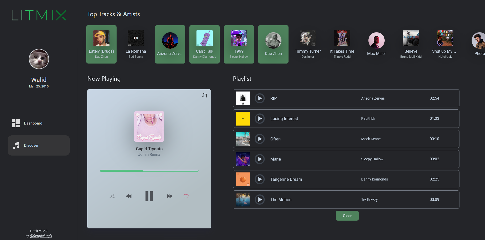

<!-- PROJECT LOGO -->
 

  

  

     
  

  

[![TS][TS]][TS-url]
[![React][React]][React-url]
[![Spotify][Spotify]][Spotify-url]

<a href="https://litmix.web.app/">
    litmix.web.app
</a>
    

## About this project

This web app combines all my Spotify projects. To access, simply upload your Extended Spotify Data. 
It's designed for a straightforward music experience.

### Streaming History Analysis
- Yearly & lifetime stream durations
- Daily streaming heatmap
- Top tracks & artists
- Favorite genres
- Peak streaming times (hour/day)
- Various visual stats (graphs & bars)

### Discover Music
- Choose from your pool of top artists & tracks as seeds
- Get continuous recommendations
- Add tracks to a playlist

## Requesting your Data from Spotify
To use this web app, you'll need to provide your Extended Spotify Data. Here's how you can request it:

**Log in to Spotify**
> Go to Spotify's Account page.
> 
> Sign in with your credentials.

**Navigate to the Privacy Settings**
> On the left sidebar, click on Privacy Settings.

**Request Your Data**
> Scroll down until you see the Download Your Data section.
>
> Click on Request and Spotify will start preparing your data. This might take a few days.

**Download Your Data**
> Once your data is ready, Spotify will send you an email with a download link.
> 
> Download the data and keep it safe.

**Upload to the Web App**
> Return to our web app and upload the downloaded data where prompted.

 
<!-- SCREENSHOTS -->

## Screenshots

  
  

   

 

## Data and Privacy

We take your privacy seriously. All the data you upload is processed right on your own device; it doesn't go anywhere else. The only time the app reaches out to the internet is to fetch additional details like track images or audio files from Spotify, using secure connections. Your data stays yours, always.

<!-- CONTACT -->

## Contact

Distributed under the MIT License. See `LICENSE.txt` for more information.

Walid Harkous- [@github](https://github.com/SimpleLogix) - harkouswalid@gmail.com

Project Link: [Litmix](https://github.com/SimpleLogix/litmix)

(<a href="#readme-top">back to top</a>)

[React]: https://img.shields.io/badge/React-20232A?style=for-the-badge&logo=react&logoColor=61DAFB
[React-url]: https://react.dev/
[TS]: https://img.shields.io/badge/TypeScript-007ACC?style=for-the-badge&logo=typescript&logoColor=white
[TS-url]: https://www.typescriptlang.org/
[Spotify]: https://img.shields.io/badge/Spotify-1ED760?&style=for-the-badge&logo=spotify&logoColor=white
[Spotify-url]: https://developer.spotify.com/documentation/web-api
